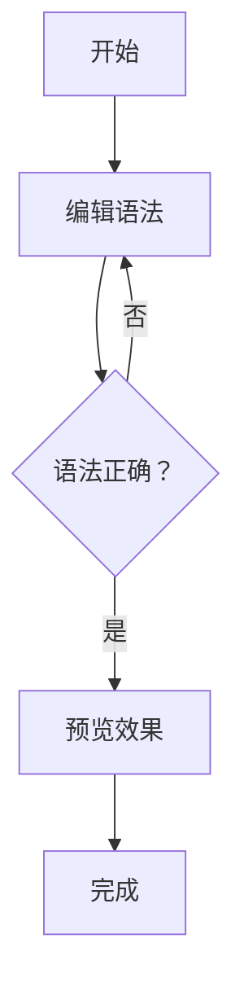

# Markdown 原生基础语法与 Typora 进阶语法全指南

本文将分两部分，**结构化梳理 Markdown 原生基础语法**（通用兼容，适用于所有 Markdown 编辑器）和 **Typora 进阶扩展语法**（仅 Typora 支持，提升编辑效率），每个语法点均包含「语法规则」和「实际示例」，确保可直接复用。

## 一、Markdown 原生基础语法（通用兼容）

基于 **CommonMark 标准**（Markdown 核心规范）和 **GitHub Flavored Markdown (GFM)** 扩展（主流平台均支持，如 GitHub、VS Code），语法具有跨编辑器兼容性。

### 1. 标题（1-6 级）

通过 `#` 符号定义，`#` 数量对应标题级别（1 级最高，6 级最低），`#` 后需加**空格**。

| 语法                 | 效果（预览模式）        | 说明                  |
| -------------------- | ----------------------- | --------------------- |
| `# 一级标题`       | # 一级标题              | 对应 HTML 的 `<h1>` |
| `## 二级标题`      | ## 二级标题             | 对应 HTML 的 `<h2>` |
| `### 三级标题`     | ### 三级标题            | 对应 HTML 的 `<h3>` |
| `###### 六级标题`  | ###### 六级标题         | 对应 HTML 的 `<h6>` |
| `####### 七级标题` | 无效果（仅支持 1-6 级） | 超过 6 个 `#` 无效  |

### 2. 文本样式

涵盖加粗、斜体、删除线等常用格式，部分为 GFM 扩展语法。

| 样式      | 语法                             | 示例                   | 效果（预览模式）           |
| --------- | -------------------------------- | ---------------------- | -------------------------- |
| 加粗      | `**文本**` 或 `__文本__`     | `**重要内容**`       | **重要内容**         |
| 斜体      | `*文本*` 或 `_文本_`         | `*强调内容*`         | *强调内容*               |
| 加粗+斜体 | `***文本***` 或 `___文本___` | `***重点强调***`     | ***重点强调***     |
| 删除线    | `~~文本~~`（GFM 扩展）         | `~~已废弃内容~~`     | ~~已废弃内容~~            |
| 行内代码  | `` `代码片段` ``                 | `` `print("Hello")` `` | `print("Hello")`         |
| 下划线    | `<u>文本</u>`（非标准但通用）  | `<u>下划线内容</u>`  | `<u>`下划线内容 `</u>` |

### 3. 引用（块级/嵌套）

通过 `>` 定义引用块，`>` 后加空格；支持嵌套（多组 `>`）。

#### 语法

- 单层引用：`> 引用内容`
- 嵌套引用：`>> 嵌套引用内容`（在父引用基础上多加一个 `>`）

#### 示例

```markdown
> 这是单层引用（如名言、引用内容）
> 
>> 这是嵌套引用（引用中的引用，用于层级说明）
>> - 嵌套引用内可嵌套列表
>> - 也可嵌套其他格式（如加粗 **文本**）
```

#### 预览效果

> 这是单层引用（如名言、引用内容）
>
>> 这是嵌套引用（引用中的引用，用于层级说明）
>>
>> - 嵌套引用内可嵌套列表
>> - 也可嵌套其他格式（如加粗 **文本**）
>>

### 4. 列表（有序/无序/任务列表）

支持无序列表、有序列表和任务列表（GFM 扩展），列表项后可嵌套其他元素（如引用、代码块）。

#### （1）无序列表

通过 `-`、`+` 或 `*` 定义，符号后加空格，三者效果一致。

| 语法          | 示例       | 预览效果 |
| ------------- | ---------- | -------- |
| `- 列表项1` | `- 苹果` | - 苹果   |
| `+ 列表项2` | `+ 香蕉` | + 香蕉   |
| `* 列表项3` | `* 橙子` | * 橙子   |

#### （2）有序列表

通过「数字 + `.` + 空格」定义，数字无需连续（最终按排列顺序显示）。

| 语法          | 示例              | 预览效果                      |
| ------------- | ----------------- | ----------------------------- |
| `1. 第一步` | `1. 打开编辑器` | 1. 打开编辑器                 |
| `2. 第二步` | `2. 输入语法`   | 2. 输入语法                   |
| `5. 第三步` | `5. 预览效果`   | 3. 预览效果（数字不影响顺序） |

#### （3）任务列表（GFM 扩展）

通过 `- [ ]`（未完成）或 `- [x]`（已完成）定义，`[ ]` 内需加空格或 `x`。

| 语法                 | 示例               | 预览效果       |
| -------------------- | ------------------ | -------------- |
| `- [ ] 未完成任务` | `- [ ] 学习语法` | - [ ] 学习语法 |
| `- [x] 已完成任务` | `- [x] 练习示例` | - [x] 练习示例 |

### 5. 链接（行内式/参考式）

链接由「链接文本」和「URL」组成，支持行内式（直接嵌入）和参考式（单独定义，适合多次引用）。

#### （1）行内式链接

直接在文本后紧跟 URL，可加可选「标题」（hover 时显示）。

| 语法                           | 示例                                    | 预览效果                      |
| ------------------------------ | --------------------------------------- | ----------------------------- |
| `[链接文本](URL)`            | `[GitHub](https://github.com)`        | [GitHub](https://github.com)     |
| `[链接文本](URL "可选标题")` | `[Google](https://google.com "搜索")` | [Google](https://google.com "搜索") |

#### （2）参考式链接

先通过「标签」定义链接，再在正文引用标签，适合长文档或多次引用同一链接。

| 语法（分两部分）                        | 示例                                    | 预览效果                  |
| --------------------------------------- | --------------------------------------- | ------------------------- |
| 1. 正文引用：`[链接文本][标签]`       | 1.`[GitHub][gh]`                      | 1. [GitHub][gh]           |
| 2. 标签定义：`[标签]: URL "可选标题"` | 2.`[gh]: https://github.com "代码库"` | 2. 标签定义不显示在预览中 |

### 6. 图片（行内式/参考式）

与链接语法类似，仅需在开头加 `!`，`替代文本` 用于图片加载失败时显示。

#### （1）行内式图片

| 语法                          | 示例（本地/网络图片）                      | 说明                      |
| ----------------------------- | ------------------------------------------ | ------------------------- |
| `` | `` | 网络图片：直接用 URL      |
| ``     | ``           | 本地图片：用相对/绝对路径 |

#### （2）参考式图片

与参考式链接逻辑一致，标签单独定义。

```markdown
# 正文引用
![示例图片][img1]

# 标签定义（可放在文档末尾）
[img1]: https://picsum.photos/300 "这是一张示例图片"
```

### 7. 分割线

通过 3 个及以上 `-`、`*` 或 `_` 定义，需**单独一行**，前后建议空行（避免与标题混淆）。

| 语法    | 示例    | 预览效果（一条水平线） |
| ------- | ------- | ---------------------- |
| `---` | `---` | ---------------------  |
| `***` | `***` | ---------------------  |
| `___` | `___` | ---------------------  |

### 8. 表格（GFM 扩展）

通过 `|` 分隔列，第二行用 `---` 分隔表头与内容，`:` 可控制列对齐（左对齐、居中、右对齐）。

#### 语法规则

- 表头与内容需用 `|` 包裹，列数一致
- 对齐方式：`---` 左侧加 `:` → 左对齐；两侧加 `:` → 居中；右侧加 `:` → 右对齐

#### 示例

```markdown
| 姓名 | 年龄 | 职业       |
| :--- | :--: | ----------:|
| 张三 |  25  | 程序员     |
| 李四 |  30  | 产品经理   |
```

#### 预览效果

| 姓名 | 年龄 |     职业 |
| :--- | :--: | -------: |
| 张三 |  25  |   程序员 |
| 李四 |  30  | 产品经理 |

### 9. 脚注（GFM 扩展）

用于文档末尾添加补充说明，正文通过 `[^标签]` 引用，文末通过 `[^标签]: 内容` 定义。

#### 示例

```markdown
正文内容：Markdown 语法简单易用[^1]，适合快速写作[^2]。

# 文末脚注（位置不影响引用，建议放文档末尾）
[^1]: 由 John Gruber 于 2004 年创建。
[^2]: 无需手动调整格式，专注内容创作。
```

#### 预览效果

正文内容：Markdown 语法简单易用[^1]，适合快速写作[^2]。

### 10. 目录（部分解析器支持）

通过 `[TOC]` 自动提取文档中所有标题（1-6 级），生成可跳转的目录，位置决定目录在文档中的显示位置。

#### 语法

```markdown
# 文档标题
[TOC]  # 目录将显示在这里

## 第一章
### 1.1 小节
## 第二章
```

#### 预览效果

目录会自动列出「第一章」「1.1 小节」「第二章」，点击可跳转至对应标题。

## 二、Typora 进阶语法（仅 Typora 支持）

Typora 在原生语法基础上扩展了大量实用功能，优化编辑体验，部分语法需在 Typora 设置中启用（如「图表」「数学公式」）。

### 1. 原生语法增强（优化体验，语法不变）

Typora 对原生语法的编辑体验进行了优化，无需手动写全语法，可通过可视化操作调整。

| 功能           | 操作方式                                   | 说明                                         |
| -------------- | ------------------------------------------ | -------------------------------------------- |
| 表格可视化编辑 | 点击表格边框 → 拖拽调整列宽/添加/删除行列 | 无需手动修改 `                               |
| 目录自动更新   | 插入 `[TOC]` 后，修改标题自动同步目录    | 原生语法需手动刷新，Typora 实时更新          |
| 注释预览       | 输入 `<!-- 注释内容 -->`，hover 可查看   | 预览模式不显示注释，编辑时可快速查看隐藏说明 |

### 2. 数学公式（支持 LaTeX）

Typora 支持插入 LaTeX 数学公式，需先在「设置 → Markdown → 启用数学公式」中开启，分为「行内公式」和「块级公式」。

#### （1）行内公式

公式嵌入正文，用 `$` 包裹。

| 语法           | 示例                            | 预览效果                      |
| -------------- | ------------------------------- | ----------------------------- |
| `$数学公式$` | `勾股定理：$a^2 + b^2 = c^2$` | 勾股定理：$a^2 + b^2 = c^2$ |

#### （2）块级公式

公式单独占一行，用 `$$` 包裹（自动居中）。

| 语法             | 示例（求和公式） | 预览效果 |
| ---------------- | ---------------- | -------- |
| `$$数学公式$$` | ```markdown      |          |

$$
\sum_{i=1}^n i = \frac{n(n+1)}{2}
$$

```|


### 3. 图表（支持 Mermaid/Flowchart）
Typora 内置 Mermaid 图表引擎，支持流程图、时序图、饼图等，需在「设置 → Markdown → 启用图表」中开启，语法为 ` ```mermaid + 图表代码 + ``` `。

#### （1）流程图（最常用）
| 语法（Mermaid）     | 示例                          | 预览效果              |
|---------------------|-------------------------------|-----------------------|
| `graph 方向 + 节点` | ```markdown
```mermaid
graph TD  # TD = 从上到下（Top-Down）
    A[开始] --> B[编辑语法]
    B --> C{语法正确？}
    C -->|是| D[预览效果]
    C -->|否| B
    D --> E[完成]
```

```|


 |

#### （2）时序图

```markdown
```mermaid
sequenceDiagram  # 时序图
    客户端 ->> 服务器： 发送请求（GET /data）
    服务器-->>客户端： 返回数据（JSON）
```

```

#### 预览效果
```mermaid
sequenceDiagram
    客户端 ->> 服务器： 发送请求（GET /data）
    服务器-->>客户端： 返回数据（JSON）
```

### 4. 代码块高亮（多语言支持）

原生语法仅支持代码块标记，Typora 支持**语法高亮**（数百种编程语言），通过 ` ```语言名称 ` 定义。

| 语法        | 示例（Python 代码） | 预览效果（高亮） |
| ----------- | ------------------- | ---------------- |
| ```语言名称 |                     |                  |
| 代码        |                     |                  |
| ```         | ```markdown         |                  |

```python
# 计算 1+2
a = 1
b = 2
print(f"结果：{a + b}")
```

```|
```python
# 计算 1+2
a = 1
b = 2
print(f"结果：{a + b}")
```

 |

### 5. 特殊文本格式（Typora 特有）

这些格式为 Typora 独家扩展，原生 Markdown 不支持，导出为 HTML/PDF 时需用 Typora 渲染。

| 格式     | 语法              | 示例                  | 预览效果                                     |
| -------- | ----------------- | --------------------- | -------------------------------------------- |
| 高亮     | `==文本==`      | `==重点内容==`      | ==重点内容==                                 |
| 上标     | `文本^上标^`    | `x^2^ + y^2^`       | x^2^ + y^2^                                  |
| 下标     | `文本~下标~`    | `H~2~O（水）`       | H~2~O（水）                                 |
| 表情符号 | `:emoji关键词:` | `:smile: :warning:` | 😄 ⚠️（支持搜索：输入 `:` 后输入关键词） |

### 6. 文档内跳转（锚点链接）

通过「标题锚点」实现文档内快速跳转，语法为 `[跳转文本](#标题文本)`，需注意：

- 标题文本需与目标标题完全一致（区分大小写，保留空格）
- 若标题含特殊字符（如 `#`、`&`），需转义（Typora 可自动生成锚点）

#### 示例

```markdown
# 目录
- [1. 数学公式](#2-数学公式)  # 跳转至“2. 数学公式”章节
- [2. 图表](#3-图表)        # 跳转至“3. 图表”章节

## 2. 数学公式（目标标题）
## 3. 图表（目标标题）
```

#### 操作技巧

在 Typora 中，右键目标标题 →「复制链接地址」，可直接获取锚点语法（无需手动写 `#`）。

### 7. 本地文件引用（拖拽支持）

Typora 支持直接拖拽本地文件（图片、文档）生成引用链接，自动处理路径：

- 拖拽图片：自动生成 ``（如 ``）
- 拖拽文档：自动生成 `[文档名](路径)`（如 `[笔记.docx](./docs/笔记.docx)`）

## 三、语法兼容性说明

| 语法类型      | 兼容性范围                     | 使用建议                                                            |
| ------------- | ------------------------------ | ------------------------------------------------------------------- |
| Markdown 原生 | 所有 Markdown 编辑器（100%）   | 跨平台分享（如 GitHub、Notion）时优先使用                           |
| GFM 扩展      | 多数平台（GitHub、VS Code 等） | 适合添加表格、任务列表，兼容性较高                                  |
| Typora 进阶   | 仅 Typora 支持（0% 跨平台）    | 个人编辑（如本地笔记）时使用，提升效率；需分享时建议导出为 PDF/HTML |

通过以上语法，可满足从「基础文档写作」到「复杂笔记（含公式、图表）」的全场景需求，建议根据使用场景选择对应的语法（通用场景用原生，个人场景用 Typora 进阶）。
